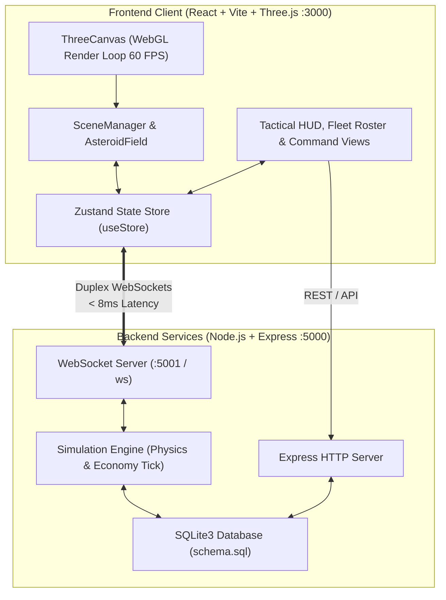

# 🌌 Astrolith (GameInterstellar)

<div align="center">

[](https://threejs.org/)
[](https://get.webgl.org/)
[](https://react.dev/)
[](https://github.com/pmndrs/zustand)
[](https://developer.mozilla.org/en-US/docs/Web/API/WebSockets_API)
[](https://sqlite.org/)
[](LICENSE)

**High-Performance Full-Stack 3D Space Simulation & Real-Time Telemetry Engine**

[Quick Start](#-quick-start) &bull; [Architecture](#-system-architecture) &bull; [Monorepo Structure](#-repository-structure) &bull; [Contributing](#-contributing)

</div>

---

## 🌟 Overview

**Astrolith** is a full-stack space simulation monorepo featuring an interactive **Three.js WebGL canvas** with real-time physics, high-frequency **WebSocket synchronization**, and a persistent **SQLite3 backend**.

Designed for immersive interactive web experiences, Astrolith couples a React frontend with a Node.js simulation daemon, maintaining sub-8ms state replication for asteroid physics, fleet outfitting, and multi-sector navigation.

---

## 🏗️ System Architecture



---

## 🚀 Key Features

- **🚀 60 FPS WebGL Rendering**: Three.js instanced geometry, dynamic celestial lighting, procedural particle starfields, and freeform camera orbit controls.
- **⚡ Low-Latency WebSocket Replication**: High-frequency duplex sync between client state and server simulation clock.
- **🪐 State Management via Zustand**: Decoupled 3D canvas render ticks from React DOM lifecycle, preventing frame drops.
- **🗄️ Embedded SQLite3 Persistence**: Zero-configuration relational storage tracking vessel upgrades, player alliances, and economic commodities.
- **📦 Monorepo Orchestration**: Single root command spinning up client and backend server concurrently.

---

## 📂 Repository Structure

```text
astrolith/
├── package.json               # Root workspace package.json & concurrent runner
├── LICENSE                    # MIT Open-Source License
├── CONTRIBUTING.md            # Contributor guidelines
├── .github/                   # Bug report & feature templates
├── client/                    # Frontend React + Vite + Three.js
│   ├── src/
│   │   ├── components/        # ThreeCanvas, SceneManager, AsteroidField, HUD
│   │   ├── pages/             # TacticalView, SectorMap, CommandHubView, Home
│   │   ├── store/             # Zustand store & WebSocket message handlers
│   │   └── utils/             # Web Audio synthesizer & math helpers
│   └── vite.config.js         # Vite configuration with API/WS proxies
└── server/                    # Backend Node.js Express & WebSocket service
    ├── src/
    │   ├── index.js           # Server entry point
    │   ├── db.js              # SQLite database configuration
    │   ├── simulationEngine.js# Physics tick & economy loop
    │   └── websocketServer.js # Client session broadcaster
    └── schema.sql             # Relational table schemas
```

---

## 🏃 Quick Start

### 1. Installation
```bash
git clone https://github.com/RohanKhadke20/GameInterstellar.git
cd GameInterstellar
npm run install:all
```

### 2. Launch Client & Server Concurrently
```bash
npm run dev
```

- **Client Viewport**: [http://localhost:3000](http://localhost:3000)
- **Express Backend**: [http://localhost:5000](http://localhost:5000)
- **WebSocket Gateway**: `ws://localhost:5001`

---

## 📜 License & Community

- Distributed under the **MIT License**. See [`LICENSE`](LICENSE) for details.
- Review [`CONTRIBUTING.md`](CONTRIBUTING.md) to propose enhancements or submit pull requests.
